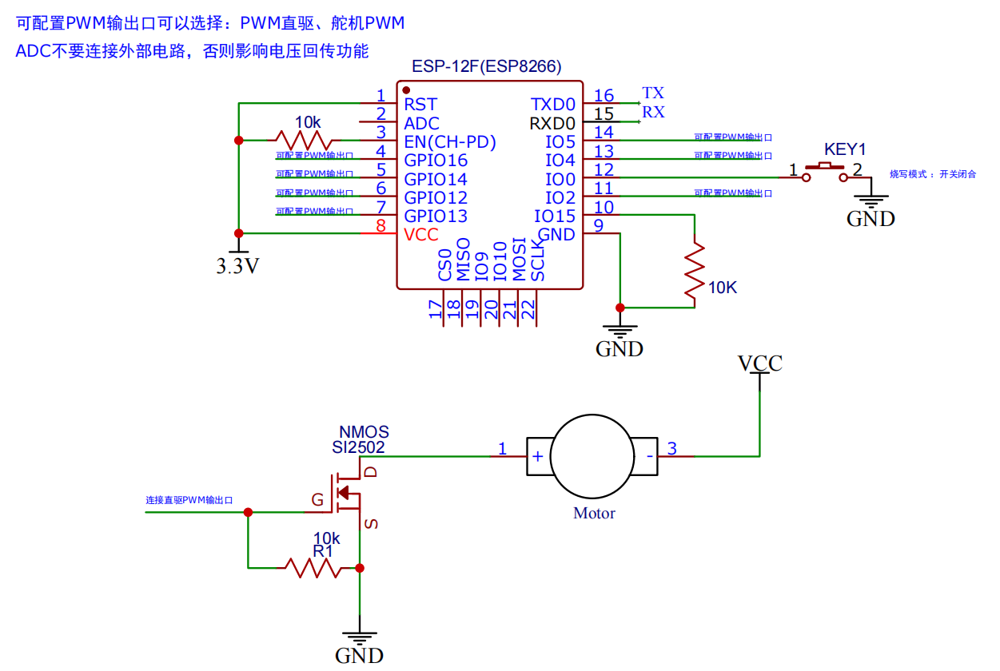
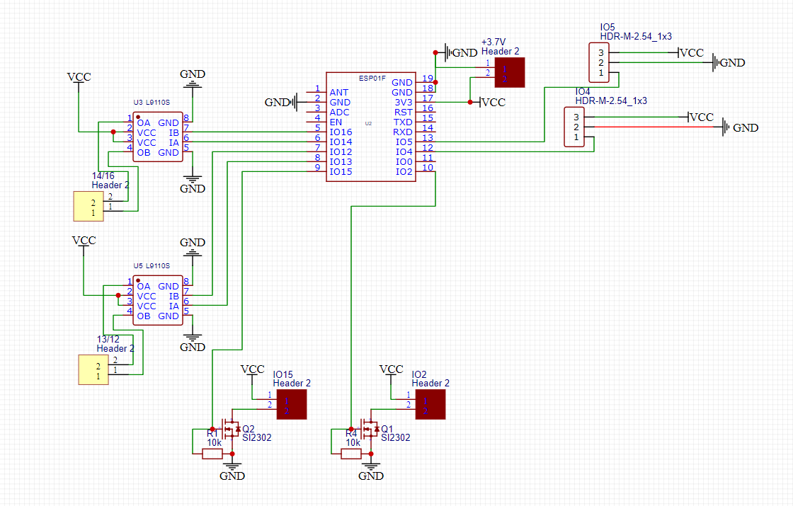

# open-rc-esp

###1. 配合Android端遥控器[OpenRc Android](https://github.com/wang-x-zhen/open-rc-android)

###2. 目前支持ESP8266/ESP8285
###根据芯片不同 
请改动 platformio.ini文件里的 

###3. mac/win 使用Clion 系统不同需要清空 cmake-build-nodemcuv2文件夹下的所有文件（cmake-build-nodemcuv2文件夹还需要保留），然后 Tools-> PlatformIO -> Re-init

###4. WebOTA 直接通过wifi升级接收机固件 http://192.168.x.x:8080/webota

`board = esp8285` // esp8285
or
`board = nodemcuv2`  // ESP8266 

###3. 应用的项目演示视频 
[二十分钟做个会漂移的遥控小车](https://www.bilibili.com/video/BV1zY41187JN/)

[电磁舵机控制](https://www.bilibili.com/video/BV1BF411q7JE/)

ESP8266

ESP8285

